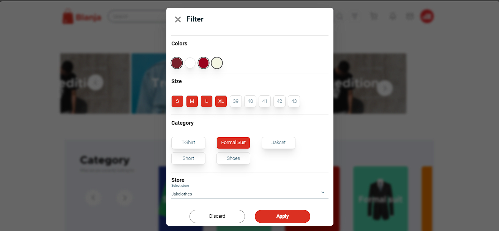
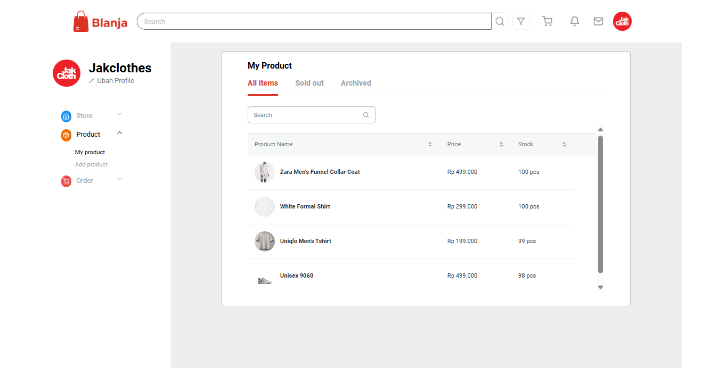

<div align="center">
  <a href="https://github.com/dimassagngsptr/blanja-kelompok-1.git">
      
  </a>

  <h1 align="center">Blanja</h1>

  <p align="center">
    Blanja Implementation
    <br />
    <br />
   <a href="https://innovation-blanja.vercel.app/" target="_blank">View Demo</a>
    ·
    <a href="https://github.com/dimassagngsptr/golang-server-blanja.git" target="_blank">View Back-End Repo</a>
  </p>
</div>

## Table Of Contents 

- [Table of Contents](#table-of-contents)
- [About The Project](#about-the-project)
  - [Built With](#built-with)
- [Getting Started](#getting-started)
  - [Installation](#installation)
  - [Screenshots](#screenshots)
- [Contributors](#contributors)
- [Contributing](#contributing)
- [License](#license)
- [Contact](#contact)
- [Documentation](#documentation)
- [Related Project](#related-project)

## About The Project

**Blanja** is an e-commerce application designed for finding and selling various kinds of items. It offers two roles: buyer and seller. The application is developed to provide users with recommended products tailored to their preferences. For those unsure where to sell their items, Blanja offers a seamless solution for online selling. Start your store now and sell your items easily and quickly on Blanja. The platform emphasizes user-friendly navigation and is designed to be responsive and accessible across various devices.

### Built With

These are the language, framework and packages to building the web

- [Javascript](https://nodejs.org/en)
- [React.Js](https://react.dev/)
- [React Router Dom](https://reactrouter.com/en/main)
- [Tailwind CSS](https://tailwindcss.com/)
- [Redux Toolkit](https://redux-toolkit.js.org/)

## Getting Started

### Installation

1. Clone this repository

```sh
git clone https://github.com/dimassagngsptr/blanja-kelompok-1.git
```

2. Go to folder Peworld

Run this command to open the folder

```sh
cd blanja-kelompok-1/apps/web
```

Run this command to open your Visual Studio Code

```sh
code .
```

3. Install all of the required modules

using NPM

```sh
npm install
```

<!-- using Yarn

```sh
yarn add
``` -->

4.Create file enviroment variable `sh .env `

```sh
VITE_API_URL=https://api-blanja.com
VITE_CLIENT_KEY=midtrans client key
VITE_MIDTRANS_API_URL=https://app.sandbox.midtrans.com
```

5. Run this command to run the project

using NPM

```sh
npm run dev
```

<!-- using Yarn

```sh
yarn dev
``` -->

6. For testing

`role buyer`

```sh
email : costumer@gmail.com
pass  : @Costumer123
```

` role seller`

```sh
email : seller@gmail.com
pass  : @Seller123
```

## Screenshots

<table>
  <tr>
    <td>Login Page</td>
    <td>Register Page</td>
  </tr>
  <tr>
    <td></td>
    <td></td>
  </tr>
  <tr>
    <td>Home page before login</td>
    <td>Home page after</td>
  </tr>
  <tr>
    <td></td>
    <td></td>
  </tr>
  <tr>
    <td>Search</td>
    <td>Product Detail</td>
  </tr>
  <tr>
    <td></td>
    <td></td>
  </tr>
  <tr>
    <td>Cart</td>
    <td>Payment</td>
  </tr>
  <tr>
    <td></td>
    <td></td>
  </tr>
  <tr>
    <td>Profile Customer</td>
    <td>add shipping address</td>
  </tr>
  <tr>
    <td></td>
    <td></td>
  </tr>
  <tr>
    <td>My order</td>
    <td>Filter Product</td>
  </tr>
  <tr>
    <td></td>
    <td>
    
    </td>
  </tr>
  <tr>
    <td>Profile Store</td>
    <td>Store Product</td>
  </tr>
  <tr>
    <td></td>
    <td></td>
  </tr> 
    <tr>
    <td>Add Store Product</td>
    <!-- <td>Store order</td> -->
  </tr>
  <tr>
    <td></td>
    <!-- <td></td> -->
  </tr> 
</table>

### Contributors:

Here are the contributors to the project and their respective roles:

<table>
<tr>
<td>  </td>
<td>

**Dimas Ageng Saputro**: Project Manager, Fullstack Developer </br>
Github   :  [github.com/dimassagngsptr](https://github.com/dimassagngsptr)</br>
Linkedin : [linkedin.com/in/dimasagengsaputro](https://www.linkedin.com/in/dimasagengsaputro/)

</td>
</tr>
<tr>
<td>  </td>
<td>

**Abdul Ghaffar Sidik**: Fullstack Developer </br>
Github   :  [github.com/ghofarsidik](https://github.com/ghofarsidik)</br>
Linkedin : [linkedin.com/in/abdul-ghaffar-sidik](https://www.linkedin.com/in/abdul-ghaffar-sidik/)

</td>
</tr>
<tr>
<td>  </td>
<td>

**Burhanuddin Azhar**: Frontend Developer </br>
Github   :  [github.com/Azhar-54](https://github.com/Azhar-54) </br>
Linkedin : [linkedin.com/in/burhanudin-azhar](https://www.linkedin.com/in/burhanudin-azhar/)

</td>
</tr>


</table>

### Contributing

Contributions are what make the open source community such an amazing place to learn, inspire, and create. Any contributions you make are

**greatly appreciated**.

1. Fork the Project
2. Create your Feature Branch (`git checkout -b feature/AmazingFeature`)
3. Commit your Changes (`git commit -m 'feat : Add some AmazingFeature'`)
4. Push to the Branch (`git push origin feature/AmazingFeature`)
5. Open a Pull Request

### License

<!-- Distributed under the MIT License. See [`LICENSE`](https://github.com/dimassagngsptr/Peworld/edit/development/LICENSE) for more information. -->

### Contact

If you have any questions or inquiries regarding this project, feel free to contact us

Email : [dimasageng58@gmail.com](dimasageng58@gmail.com)

Linkedin : [linkedin.com/in/dimasagengsaputro](https://www.linkedin.com/in/dimasagengsaputro/)

### Documentation

The server for this project was created by [Dimas Ageng Saputro](https://github.com/dimassagngsptr) using [Go](https://go.dev/). If you want to see more about this back-end project, please visit [back-end Blanja](https://github.com/dimassagngsptr/golang-server-blanja.git)

### Related Project

:rocket: [`FrontEnd - Blanja`](https://github.com/dimassagngsptr/blanja-kelompok-1) </br>
:rocket: [`Backend - Blanja`](https://github.com/dimassagngsptr/golang-server-blanja.git)
